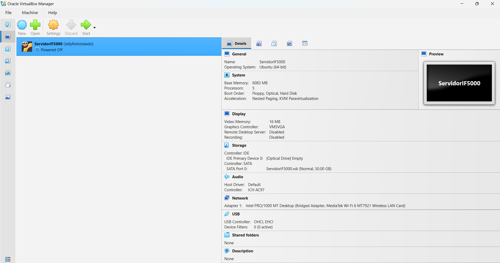
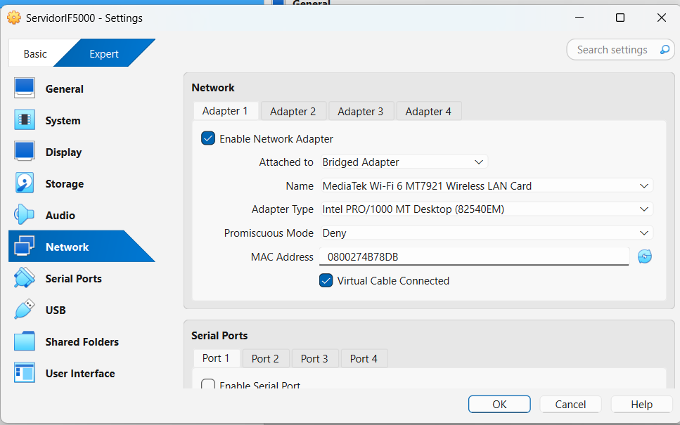
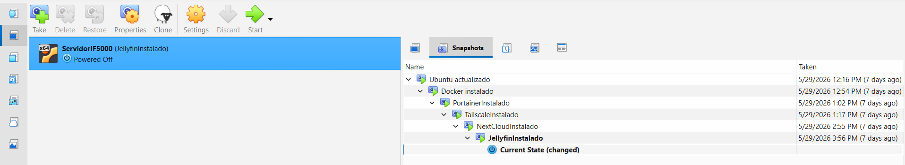

# 01 — Configuración de VirtualBox

| Campo          | Valor                                  |
|----------------|----------------------------------------|
| Plataforma      | VirtualBox 7.x sobre Windows           |
| SO invitado    | Ubuntu Server 24.04.4 LTS             |
| Red            | Bridged Adapter (MediaTek Wi-Fi 6 MT7921) |
| IP del servidor | 192.168.50.100                        |
| IP Tailscale   | 100.127.183.41                         |

---

## 1. Requisitos previos

- Virtualización habilitada en BIOS/UEFI (Intel VT-x o AMD-V).
- Windows 10/11 como sistema anfitrión (host).
- Al menos 8 GB de RAM en el host; se asignarán 4 GB a la VM.
- Al menos 80 GB de espacio libre en disco.

**Verificar virtualización en Windows:**

```powershell
# En PowerShell como administrador
Get-ComputerInfo -Property HyperVisorPresent
```

O bien, en el Administrador de tareas → pestaña Rendimiento → CPU → verificar "Virtualización: Habilitada".

---

## 2. Descarga del software

- **VirtualBox:** https://www.virtualbox.org/wiki/Downloads — descargar el instalador para Windows.
- **Ubuntu Server 24.04 LTS ISO:** https://ubuntu.com/download/server — descargar `ubuntu-24.04-live-server-amd64.iso`.

---

## 3. Creación de la máquina virtual

### 3.1 Nueva VM

1. Abrir VirtualBox → clic en **Nueva**.
2. Configurar:
   - **Nombre:** `servidor-if5000`
   - **Tipo:** Linux
   - **Versión:** Ubuntu (64-bit)
3. Clic en **Siguiente**.

### 3.2 Memoria RAM

- Asignar **6046 MB** (~6 GB).

### 3.3 Disco duro virtual

- Seleccionar **Crear un disco duro virtual ahora**.
- Tipo: **VDI (VirtualBox Disk Image)**.
- Almacenamiento: **Reservado dinámicamente**.
- Tamaño: **50 GB**.

### 3.4 Configuración de CPU

1. Con la VM seleccionada → clic en **Configuración** → **Sistema** → pestaña **Procesador**.
2. Asignar **4 CPUs**.
3. Habilitar **PAE/NX** si está disponible.

### 3.5 Montar la ISO

1. **Configuración** → **Almacenamiento**.
2. Controlador IDE → clic en el ícono de disco vacío.
3. En el panel derecho → "Atributos" → clic en el ícono de disco → **Seleccionar un archivo de disco**.
4. Navegar hasta la ISO de Ubuntu Server descargada.

---

## 4. Configuración de red Bridged

1. **Configuración** → **Red** → **Adaptador 1**.
2. Marcar **Habilitar adaptador de red**.
3. Conectado a: **Adaptador puente**.
4. Nombre: **MediaTek Wi-Fi 6 MT7921** (seleccionar el adaptador Wi-Fi activo del host).
5. Clic en **Aceptar**.

> Este modo permite que la VM obtenga una dirección IP dentro de la misma red local que el host, como si fuera una máquina física adicional.

---

## 5. Snapshots recomendados

Crear snapshots en los momentos clave del proyecto. Los snapshots permiten revertir a un estado anterior si algo falla.

**Cómo tomar un snapshot:** Menú VM → **Máquina** → **Tomar instantánea** (o `Ctrl+Shift+S`).

| Nombre del snapshot                  | Momento para tomarlo                            |
|--------------------------------------|------------------------------------------------|
| `Ubuntu base actualizado`            | Tras instalar Ubuntu y ejecutar `apt upgrade`  |
| `Docker instalado OK`                | Tras instalar Docker y verificar `hello-world` |
| `Portainer instalado OK`             | Tras verificar acceso al panel web de Portainer |
| `Acceso remoto Tailscale verificado` | Tras confirmar SSH desde un dispositivo externo |
| `Nextcloud instalado OK`             | Tras acceder a Nextcloud desde el navegador    |
| `Jellyfin instalado OK`              | Tras reproducir un archivo multimedia           |

---

## 6. Exportar la VM como OVA

Para hacer una copia de seguridad o compartir la VM:

1. VirtualBox → **Archivo** → **Exportar servicio virtualizado**.
2. Seleccionar la VM `servidor-if5000`.
3. Formato: **OVF 2.0**.
4. Guardar el archivo `.ova` en un disco externo o nube.

**Importar:**

1. VirtualBox → **Archivo** → **Importar servicio virtualizado**.
2. Seleccionar el archivo `.ova`.
3. Revisar los parámetros y confirmar la importación.

---

## Capturas de pantalla

Insertar las capturas tomadas durante la configuración:








