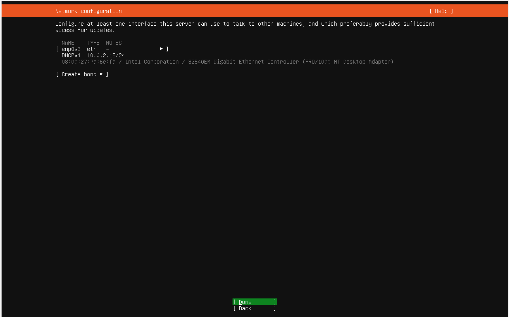
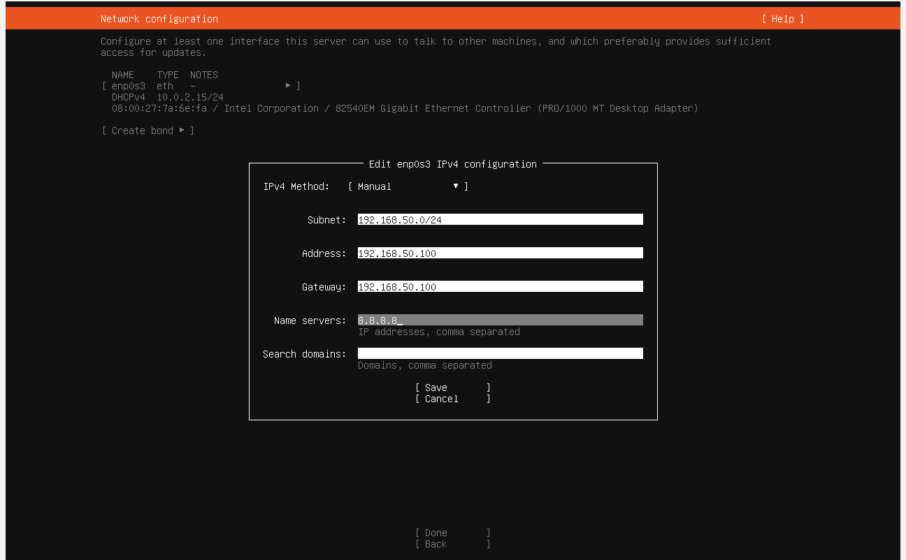
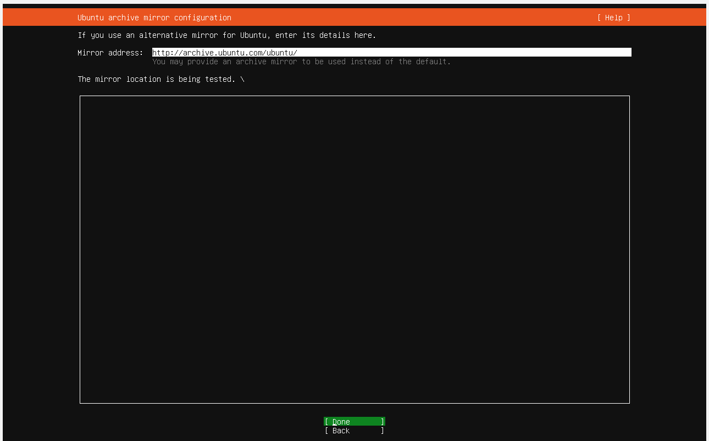
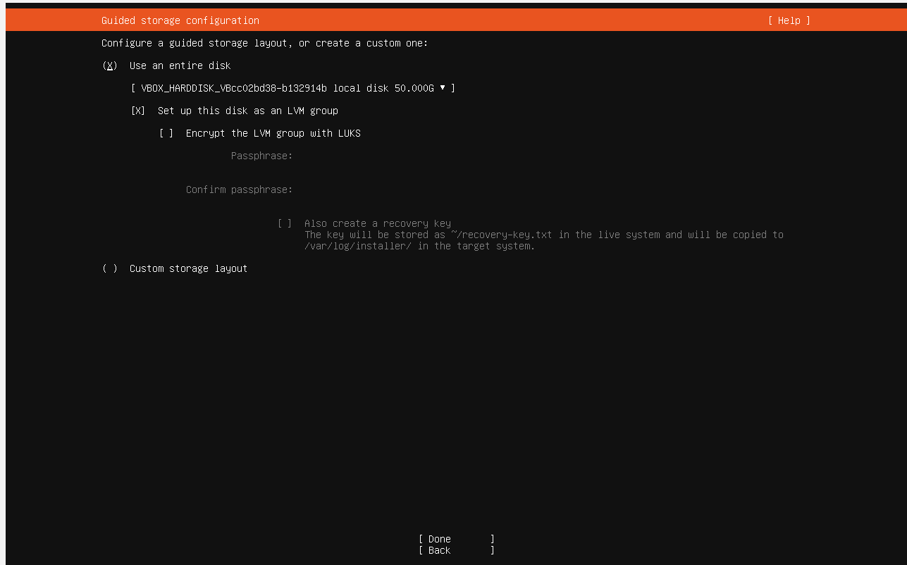
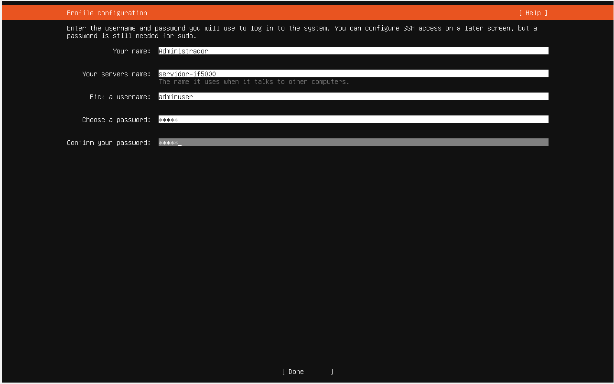
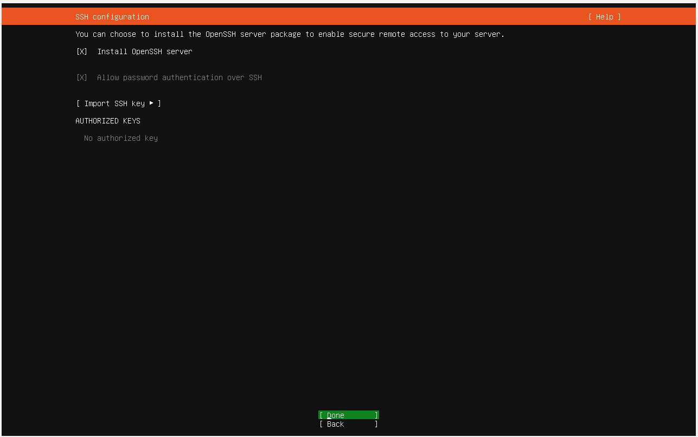
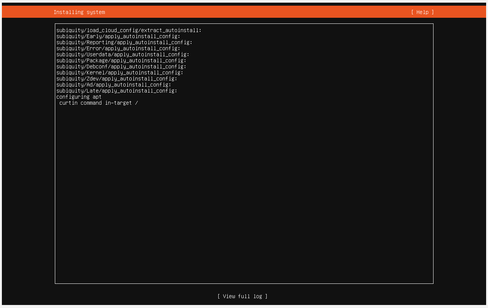

# 02 — Instalación de Ubuntu Server

| Campo          | Valor                    |
|----------------|--------------------------|
| SO             | Ubuntu Server 24.04.4 LTS |
| Hostname       | servidor-if5000          |
| Usuario admin  | adminuser                |
| IP Tailscale   | 100.127.183.41           |

---

## 1. Proceso de instalación

Al arrancar la VM con la ISO montada, el instalador de Ubuntu Server se inicia automáticamente.

### 1.1 Selección de idioma

- Seleccionar **English** (recomendado para entornos de servidor; los mensajes de error y la documentación están en inglés).

### 1.2 Actualizaciones del instalador

- Si el instalador ofrece actualizarse, seleccionar **Continue without updating** para agilizar el proceso.

### 1.3 Configuración de teclado

- Layout: **Spanish (Latin American)** o según preferencia del grupo.

### 1.4 Tipo de instalación

- Seleccionar **Ubuntu Server** (sin minimizar).

### 1.5 Configuración de red

- El instalador detectará el adaptador `enp0s3`.
- En esta etapa se puede dejar DHCP para continuar la instalación; la IP estática se configura después con Netplan.

### 1.6 Proxy

- Dejar en blanco.

### 1.7 Mirror de Ubuntu

- Dejar el espejo predeterminado o usar `http://archive.ubuntu.com/ubuntu`.

### 1.8 Configuración de almacenamiento

- Seleccionar **Use an entire disk**.
- Confirmar el disco de 50 GB.
- Aceptar el resumen de particionado.

### 1.9 Perfil del sistema

Configurar los datos del servidor:

| Campo            | Valor             |
|------------------|-------------------|
| Your name        | Admin IF5000      |
| Server's name    | servidor-if5000   |
| Username         | adminuser         |
| Password         | (definida por el grupo) |

### 1.10 Ubuntu Pro

- Seleccionar **Skip for now**.

### 1.11 Instalación de OpenSSH

- **Marcar "Install OpenSSH server"** — esto es obligatorio para el acceso remoto.

### 1.12 Snaps adicionales

- No seleccionar ninguno; el software se instalará manualmente.

### 1.13 Completar instalación

- Esperar a que finalice la instalación.
- Seleccionar **Reboot Now**.
- Al reiniciar, retirar la ISO virtual si el sistema lo solicita (presionar Enter).

---

## 2. Primer arranque

Al iniciar sesión por primera vez:

```bash
login: adminuser
password: (contraseña definida)
```

---

## 3. Actualización del sistema

Ejecutar inmediatamente después del primer arranque:

```bash
sudo apt update && sudo apt upgrade -y
```

> Este paso es obligatorio antes de instalar cualquier otro software.

---

## 4. Verificación básica del servidor

```bash
# Ver interfaces de red y direcciones IP
ip a

# Verificar conectividad a Internet
ping -c 3 google.com
ping -c 3 8.8.8.8

# Verificar el estado del servicio SSH
systemctl status ssh

# Ver usuarios conectados
who

# Ver uso del disco
df -h

# Ver memoria RAM disponible
free -h
```

---

## 5. Configuración del repositorio APT

Editar `/etc/apt/sources.list` para asegurar acceso completo a los repositorios:

```bash
sudo nano /etc/apt/sources.list
```

Contenido recomendado:

```
deb http://archive.ubuntu.com/ubuntu noble main restricted universe multiverse
deb http://archive.ubuntu.com/ubuntu noble-updates main restricted universe multiverse
deb http://security.ubuntu.com/ubuntu noble-security main restricted universe multiverse
```

Aplicar cambios:

```bash
sudo apt update
```

---

## Capturas de pantalla














