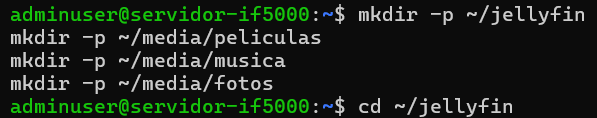
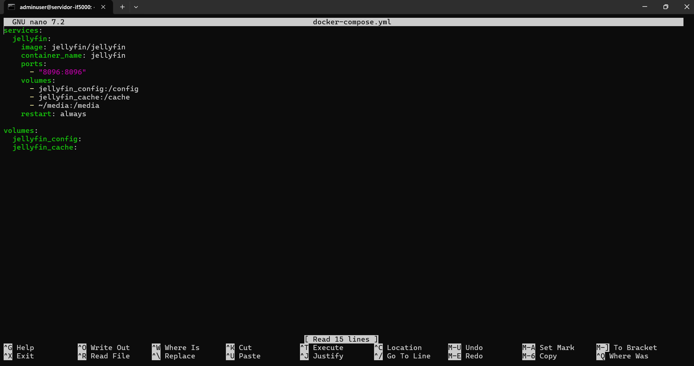
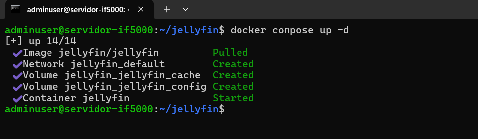
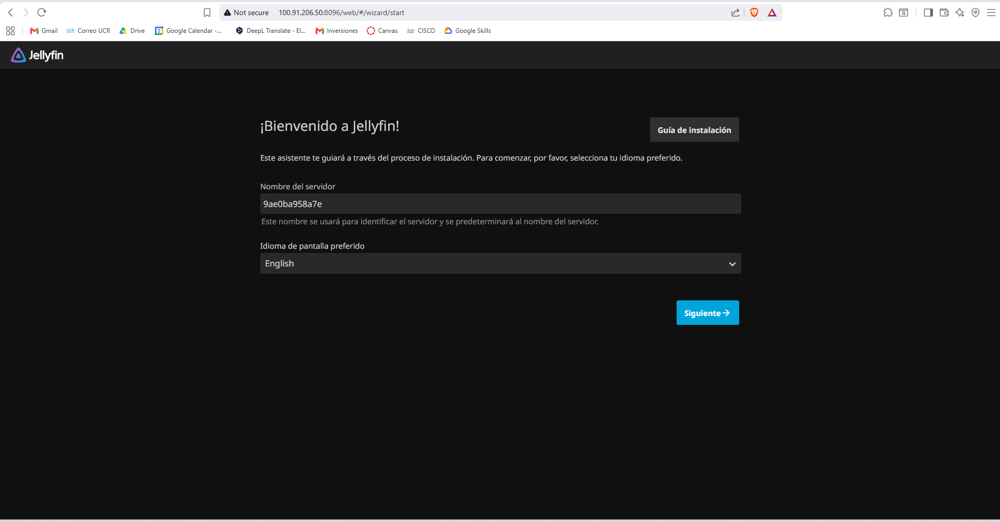
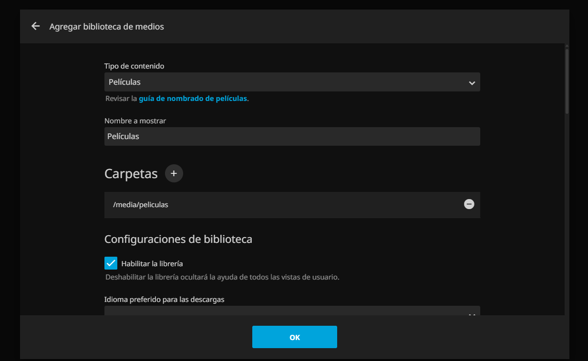
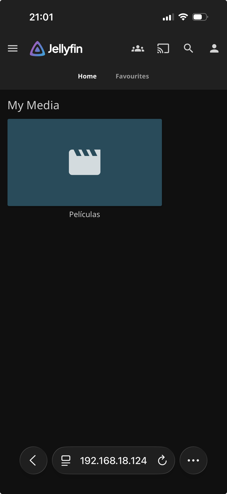

# 08 — Jellyfin (Servidor Multimedia)

| Campo         | Valor                            |
|---------------|----------------------------------|
| Servicio      | Jellyfin                         |
| Puerto        | 8096                             |
| URL local     | http://192.168.50.100:8096       |
| URL Tailscale | http://100.91.206.50:8096       |

---

## 1. ¿Qué es Jellyfin?

Jellyfin es un servidor multimedia de código abierto que permite organizar y transmitir películas, música y fotos desde el servidor a cualquier dispositivo en la red. Ofrece funcionalidades similares a Plex o Emby, pero completamente gratuito y sin servicios en la nube.

**Funcionalidades a demostrar:**
- Biblioteca de películas con metadatos automáticos
- Reproducción de video en el navegador
- Acceso desde el celular con la app oficial
- Transmisión de video vía Tailscale

---

## 2. Directorio del servicio

```bash
mkdir -p ~/jellyfin
cd ~/jellyfin

# Crear estructura de medios
mkdir -p ~/media/peliculas
mkdir -p ~/media/musica
mkdir -p ~/media/fotos
```

---

## 3. Estructura de medios

```
~/media/
├── peliculas/      ← Archivos .mp4, .mkv, .avi, etc.
├── musica/         ← Archivos .mp3, .flac, .ogg, etc.
└── fotos/          ← Archivos .jpg, .png, etc.
```

---

## 4. Archivo docker-compose.yml

```yaml
services:
  jellyfin:
    image: jellyfin/jellyfin
    container_name: jellyfin
    ports:
      - "8096:8096"
    volumes:
      - jellyfin_config:/config
      - jellyfin_cache:/cache
      - ~/media:/media
    restart: always

volumes:
  jellyfin_config:
  jellyfin_cache:
```

---

## 5. Levantar el servicio

```bash
cd ~/jellyfin
docker compose up -d
```

Verificar:

```bash
docker ps | grep jellyfin
```

---

## 6. Subir archivos multimedia al servidor

Desde Windows (PowerShell):

```powershell
# Subir una película
scp "C:\ruta\pelicula.mp4" adminuser@192.168.50.100:~/media/peliculas/

# Subir música
scp "C:\ruta\cancion.mp3" adminuser@192.168.50.100:~/media/musica/

# Subir una carpeta completa
scp -r "C:\ruta\carpeta-peliculas" adminuser@192.168.50.100:~/media/peliculas/
```

---

## 7. Configuración inicial en la interfaz web

1. Abrir `http://100.91.206.50:8096` en el navegador.
2. Seleccionar el idioma preferido.
3. Crear la cuenta de administrador:
   - Usuario: `admin`
   - Contraseña: (definida por el grupo)
4. Agregar bibliotecas de medios:
   - Clic en **Agregar biblioteca de medios**.
   - Tipo de contenido: **Películas**.
   - Ruta: `/media/peliculas`.
   - Repetir para música (`/media/musica`) y fotos (`/media/fotos`).
5. Iniciar el escaneo de la biblioteca.

---

## 8. App de Jellyfin en el celular

- **iOS:** Buscar "Swiftfin" o "Jellyfin" en App Store.
- **Android:** Buscar "Jellyfin" en Play Store.
- URL del servidor: `http://100.91.206.50:8096`
- Iniciar sesión con el usuario administrador.

---

## Capturas de pantalla

**Instalación:**







**Verificación — Servicio funcionando:**






