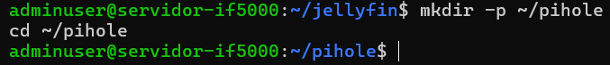
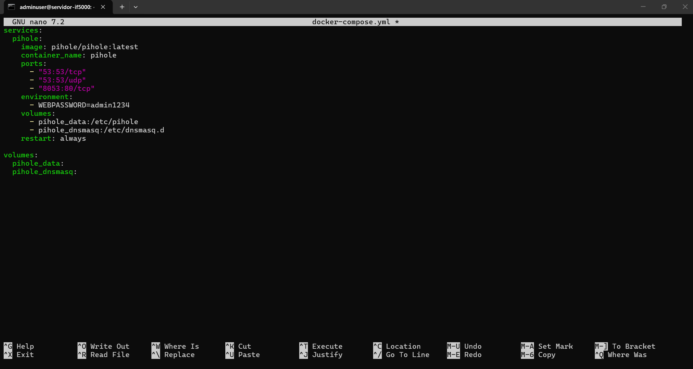
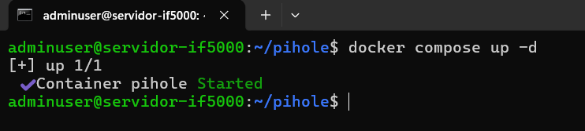
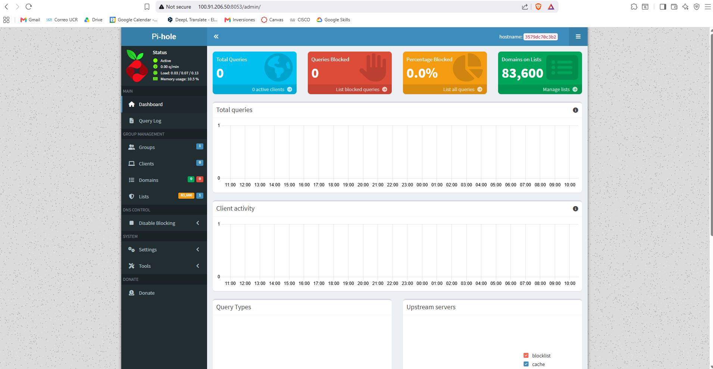
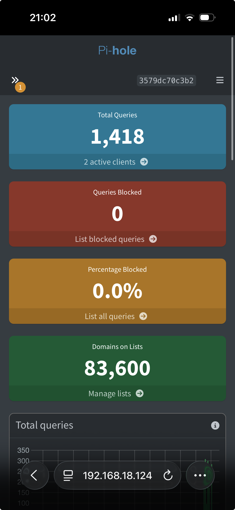

# 09 — Pi-hole (DNS y Bloqueador de Anuncios)

| Campo         | Valor                                  |
|---------------|----------------------------------------|
| Servicio      | Pi-hole                                |
| Puerto DNS    | 53 TCP/UDP                             |
| Puerto Web UI | 8053                                   |
| URL local     | http://192.168.50.100:8053/admin       |
| URL Tailscale | http://100.91.206.50:8053/admin       |

---

## 1. ¿Qué es Pi-hole?

Pi-hole es un servidor DNS que actúa como bloqueador de anuncios y rastreadores a nivel de red. Cuando los dispositivos de la red utilizan Pi-hole como servidor DNS, todas las solicitudes a dominios de publicidad son bloqueadas antes de llegar al navegador.

**Funcionalidades a demostrar:**
- Dashboard con estadísticas de consultas DNS
- Porcentaje de solicitudes bloqueadas
- Lista de dominios bloqueados
- Configuración de dispositivos clientes para usar Pi-hole como DNS

---

## 2. Directorio del servicio

```bash
mkdir -p ~/pihole
cd ~/pihole
```

---

## 3. Archivo docker-compose.yml

```yaml
services:
  pihole:
    image: pihole/pihole:latest
    container_name: pihole
    dns:
      - 8.8.8.8
    ports:
      - "53:53/tcp"
      - "53:53/udp"
      - "8053:80/tcp"
    environment:
      - WEBPASSWORD=admin1234
    volumes:
      - pihole_data:/etc/pihole
      - pihole_dnsmasq:/etc/dnsmasq.d
    restart: always

volumes:
  pihole_data:
  pihole_dnsmasq:
```

> **Nota:** La línea `dns: 8.8.8.8` es necesaria para que Pi-hole pueda resolver
> DNS durante su inicialización y descargar las listas de bloqueo. Sin esto,
> Pi-hole queda en estado `unhealthy`.

---

## 4. Levantar el servicio

```bash
cd ~/pihole
docker compose up -d
```

> **Problema frecuente:** El puerto 53 puede estar ocupado por `systemd-resolved`,
> el servicio DNS por defecto de Ubuntu. Para resolverlo:
> ```bash
> sudo systemctl stop systemd-resolved
> sudo systemctl disable systemd-resolved
> ```

Verificar:

```bash
docker ps | grep pihole
```

---

## 5. Cambiar la contraseña de administración

```bash
docker exec -it pihole pihole setpassword admin1234
```

> **Nota:** Si la contraseña del `docker-compose.yml` no se aplica automáticamente,
> cambiarla manualmente con:
> ```bash
> docker exec -it pihole pihole setpassword admin1234
> ```

---

## 6. Primer acceso al dashboard

1. Abrir `http://100.91.206.50:8053/admin`.
2. Iniciar sesión con la contraseña configurada (`admin1234`).
3. El dashboard muestra en tiempo real:
   - Total de consultas DNS procesadas
   - Porcentaje de consultas bloqueadas
   - Dominios en la lista de bloqueo
   - Clientes activos

---

## 7. Configurar Pi-hole como DNS en los dispositivos clientes

Para que un dispositivo use Pi-hole como servidor DNS:

**Windows (PowerShell — como administrador):**

```powershell
# Ver adaptadores de red
Get-NetAdapter

# Configurar DNS en el adaptador Wi-Fi
Set-DnsClientServerAddress -InterfaceAlias "Wi-Fi" -ServerAddresses 100.91.206.50
```

**Mac/Linux:**

```bash
# Cambiar el servidor DNS (temporal)
sudo resolvectl dns <interfaz> 100.91.206.50
```

**Celular (Android/iOS):**

- Ir a configuración Wi-Fi → red activa → DNS manual.
- Ingresar `100.91.206.50` como servidor DNS primario.

> El dispositivo cliente debe tener Tailscale activo para alcanzar la IP `100.91.206.50`.

---

## 8. Puertos utilizados

| Puerto    | Protocolo | Función                     |
|-----------|-----------|------------------------------|
| 53        | TCP/UDP   | Servidor DNS                 |
| 8053      | TCP       | Interfaz web de administración |

---

## Capturas de pantalla











---

## Fuentes

- Pi-hole Docker — Repositorio oficial: https://github.com/pi-hole/docker-pi-hole
- Pi-hole Documentation: https://docs.pi-hole.net
