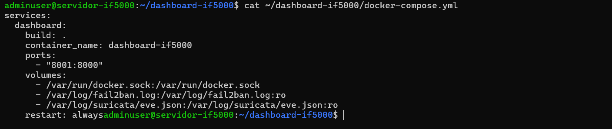
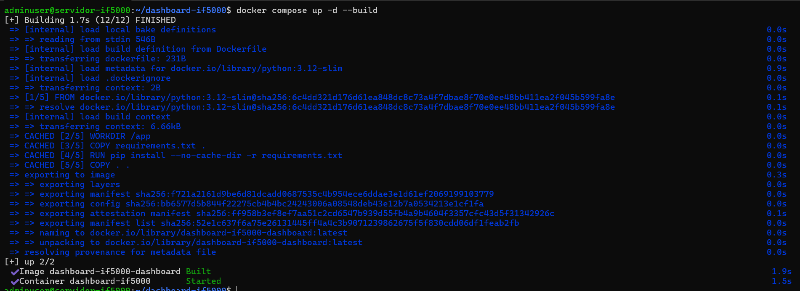
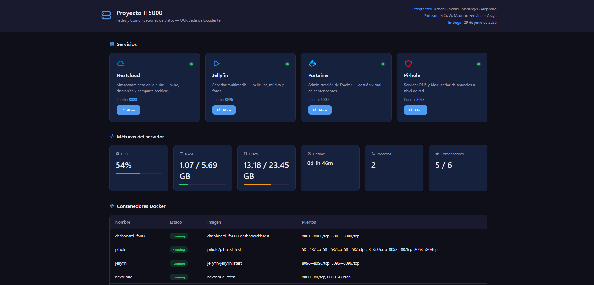
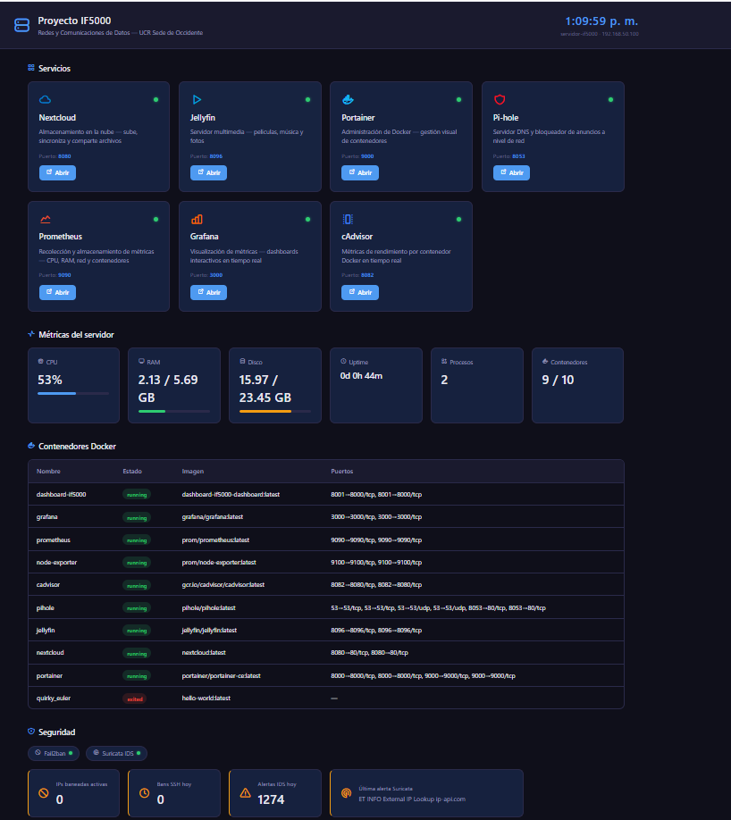

# 11 — Aplicación adicional: Dashboard IF5000

| Campo | Valor |
|-------|-------|
| Aplicación | Dashboard IF5000 |
| Tipo | Aplicación web de monitoreo |
| Puerto | 8001 |
| URL local | http://192.168.50.100:8001 |
| URL Tailscale | http://100.91.206.50:8001 |
| Tecnología | Python 3.12 / Django 5.x |
| Repositorio | https://github.com/KendalTC/dashboard-if5000 |

---

# 1. Objetivo

La aplicación adicional del proyecto consiste en un dashboard web desarrollado específicamente para centralizar el monitoreo del servidor Linux utilizado en el proyecto final de IF5000.

Desde una única interfaz es posible verificar el estado general del servidor, los servicios desplegados mediante Docker, métricas del sistema y parte de la información relacionada con la infraestructura de seguridad implementada.

---

# 2. Funcionalidades

El Dashboard IF5000 permite visualizar:

- Estado de los servicios Docker:
  - Nextcloud
  - Jellyfin
  - Portainer
  - Pi-hole
  - Prometheus
  - Grafana
  - cAdvisor

- Estado de los contenedores Docker.

- Métricas del servidor:
  - Uso de CPU
  - Memoria RAM
  - Espacio en disco
  - Uptime
  - Procesos

- Información básica del sistema SOC:
  - Eventos de Fail2ban
  - Eventos de Suricata

- Actualización automática de la información cada 30 segundos.

---

# 3. Justificación

Esta aplicación cumple con el requisito de "Aplicación adicional" del proyecto debido a que fue desarrollada específicamente para esta infraestructura y se integra directamente con el servidor Linux.

Su propósito es facilitar la supervisión del estado general del servidor durante la demostración del proyecto, permitiendo verificar rápidamente el funcionamiento de los distintos servicios desplegados.

---

# 4. Tecnologías utilizadas

| Componente | Tecnología |
|------------|------------|
| Backend | Django 5.x |
| Lenguaje | Python 3.12 |
| Métricas | psutil |
| Docker | Docker SDK for Python |
| Frontend | HTML, CSS y JavaScript |
| Despliegue | Docker Compose |

---

# 5. Despliegue

## Clonar el repositorio

```bash
git clone https://github.com/KendalTC/dashboard-if5000.git
cd dashboard-if5000
```

## Construir el contenedor

```bash
docker compose up -d --build
```

## Verificar el estado

```bash
docker ps | grep dashboard
```

---

# 6. docker-compose.yml

```yaml
services:
  dashboard:
    build: .
    container_name: dashboard-if5000

    ports:
      - "8001:8000"

    volumes:
      - /var/run/docker.sock:/var/run/docker.sock
      - /var/log/fail2ban.log:/var/log/fail2ban.log:ro
      - /var/log/suricata/eve.json:/var/log/suricata/eve.json:ro

    restart: always
```

El Dashboard utiliza el puerto interno **8000**, pero se publica externamente mediante el puerto **8001** para evitar conflictos con otros servicios del servidor.

---

# 7. Acceso

## Red local

```
http://192.168.50.100:8001
```

## Acceso mediante Tailscale

```
http://100.91.206.50:8001
```

---

# 8. Relación con el proyecto

El Dashboard se integra con los demás componentes del proyecto:

- Nextcloud
- Jellyfin
- Portainer
- Pi-hole
- Prometheus
- Grafana
- cAdvisor
- Suricata
- Fail2ban

Constituye el punto central de monitoreo del servidor durante la demostración del proyecto.

---

# 9. Capturas de pantalla

## Configuración





## Funcionamiento





---

# 10. Documentación relacionada

- `docs/dashboard.md`
- `docs/13-puertos.md`

---

# 11. Referencias

- Django Documentation: https://docs.djangoproject.com/
- Docker SDK for Python: https://docker-py.readthedocs.io/
- psutil Documentation: https://psutil.readthedocs.io/
