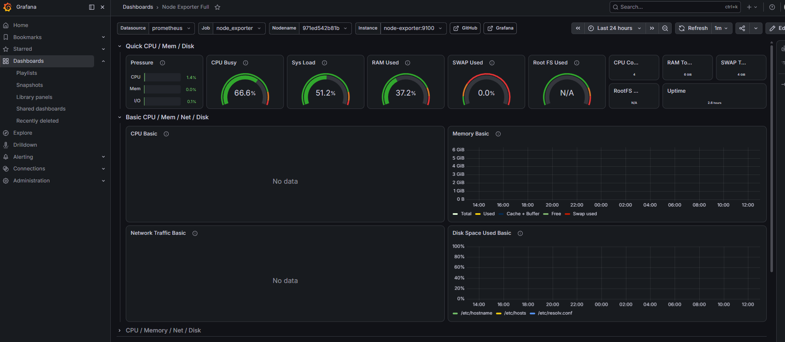
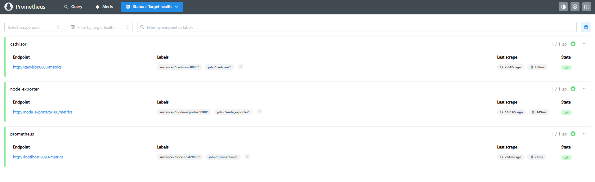
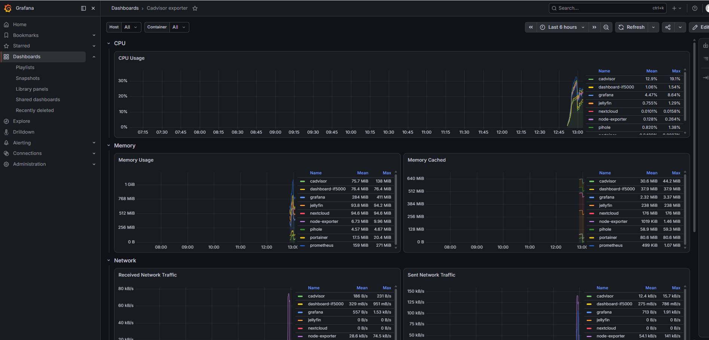

# 12 — Monitoreo del Sistema (Opcional — +15 pts)

| Herramienta   | Puerto | URL |
|---------------|--------|-----|
| Prometheus    | 9090   | http://100.91.206.50:9090 |
| Grafana       | 3000   | http://100.91.206.50:3000 |
| cAdvisor      | 8082   | http://100.91.206.50:8082 |
| Node Exporter | 9100   | (interno, sin UI web) |

---

## 1. ¿Qué es el stack de monitoreo?

El stack de monitoreo implementado utiliza cuatro herramientas que trabajan en conjunto para brindar visibilidad en tiempo real del servidor y los contenedores Docker:

```
Servidor Linux
      ↓
node-exporter     ← recolecta métricas del SO (CPU, RAM, disco, red)
cadvisor          ← recolecta métricas de los contenedores Docker
      ↓
Prometheus        ← recoge y almacena todas las métricas cada 15 segundos
      ↓
Grafana           ← visualiza las métricas en dashboards interactivos
```

| Herramienta | Función |
|-------------|---------|
| **Prometheus** | Motor central — recolecta y almacena métricas en series de tiempo |
| **Grafana** | Visualización — dashboards interactivos con gráficas y gauges |
| **Node Exporter** | Exporta métricas del sistema operativo (CPU, RAM, disco, red) |
| **cAdvisor** | Exporta métricas de cada contenedor Docker por separado |

---

## 2. Directorio del servicio

```bash
mkdir -p ~/monitoring/provisioning/datasources
mkdir -p ~/monitoring/provisioning/dashboards
cd ~/monitoring
```

---

## 3. Archivo `prometheus.yml`

```yaml
global:
  scrape_interval: 15s
  evaluation_interval: 15s

rule_files: []

scrape_configs:
  - job_name: 'prometheus'
    static_configs:
      - targets: ['localhost:9090']

  - job_name: 'cadvisor'
    static_configs:
      - targets: ['cadvisor:8080']

  - job_name: 'node_exporter'
    static_configs:
      - targets: ['node-exporter:9100']
```

> **Nota:** node-exporter NO usa `network_mode: host` — corre como contenedor normal
> con puerto `9100` expuesto para que Prometheus pueda alcanzarlo por nombre de contenedor.

---

## 4. Archivo `docker-compose.yml`

```yaml
services:
  prometheus:
    image: prom/prometheus:latest
    container_name: prometheus
    volumes:
      - ./prometheus.yml:/etc/prometheus/prometheus.yml:ro
      - prometheus-data:/prometheus
    command: --config.file=/etc/prometheus/prometheus.yml
    ports:
      - "9090:9090"
    restart: unless-stopped

  grafana:
    image: grafana/grafana:latest
    container_name: grafana
    ports:
      - "3000:3000"
    volumes:
      - grafana-data:/var/lib/grafana
    environment:
      - GF_SECURITY_ADMIN_PASSWORD=admin
    restart: unless-stopped

  node-exporter:
    image: prom/node-exporter:latest
    container_name: node-exporter
    ports:
      - "9100:9100"
    restart: unless-stopped

  cadvisor:
    image: gcr.io/cadvisor/cadvisor:latest
    container_name: cadvisor
    volumes:
      - /:/rootfs:ro
      - /var/run:/var/run:ro
      - /sys:/sys:ro
      - /var/lib/docker/:/var/lib/docker:ro
    ports:
      - "8082:8080"
    restart: unless-stopped

volumes:
  grafana-data: {}
  prometheus-data: {}
```

> **Nota:** cAdvisor usa el puerto `8082` (externo) para evitar conflicto con
> Nextcloud que ya usa el `8080`.

---

## 5. Levantar el stack

```bash
cd ~/monitoring
docker compose up -d
```

Verificar que todos los contenedores están corriendo:

```bash
docker ps | grep -E "prometheus|grafana|cadvisor|node-exporter"
```

---

## 6. Configurar Grafana

1. Abrir `http://100.91.206.50:3000`
2. Iniciar sesión: usuario `admin`, contraseña `admin`
3. Cambiar contraseña a `admin1234`
4. Ir a **Connections** → **Data Sources** → **Add data source**
5. Seleccionar **Prometheus**
6. URL: `http://prometheus:9090`
7. Clic en **Save & Test** — debe aparecer mensaje verde

---

## 7. Importar dashboards

### Dashboard de Node Exporter (métricas del servidor)

1. **Dashboards** → **New** → **Import**
2. Descargar JSON desde: https://grafana.com/grafana/dashboards/1860
3. Subir el archivo JSON
4. Seleccionar Prometheus como datasource
5. Clic en **Import**

### Dashboard de cAdvisor (métricas de contenedores)

1. **Dashboards** → **New** → **Import**
2. Descargar JSON desde: https://grafana.com/grafana/dashboards/14282
3. Subir el archivo JSON
4. Seleccionar Prometheus como datasource
5. Clic en **Import**

> **Nota:** La importación por ID directo puede fallar si Grafana no tiene
> acceso a internet. En ese caso descargar el JSON manualmente y subirlo.

---

## 8. Verificar Prometheus targets

Abrir `http://100.91.206.50:9090` → **Status** → **Targets**

Todos deben aparecer en estado **UP**:
- prometheus — UP
- cadvisor — UP
- node_exporter — UP

---

## Capturas de pantalla







---

## Fuentes

- Prometheus Documentation: https://prometheus.io/docs
- Grafana Documentation: https://grafana.com/docs
- Node Exporter: https://github.com/prometheus/node_exporter
- cAdvisor: https://github.com/google/cadvisor
- Dashboard Node Exporter Full: https://grafana.com/grafana/dashboards/1860
- Dashboard cAdvisor: https://grafana.com/grafana/dashboards/14282
