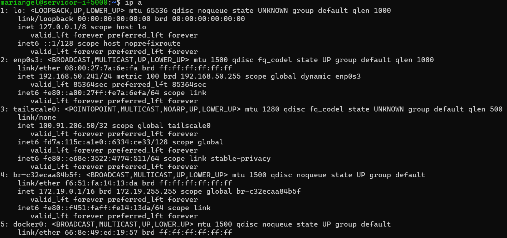
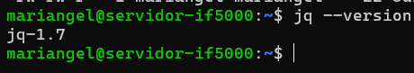
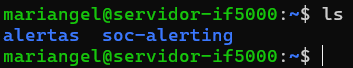
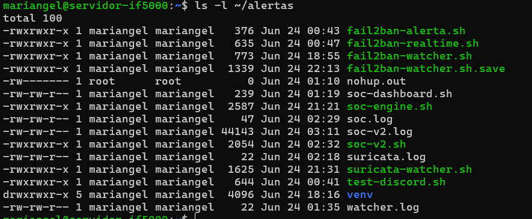
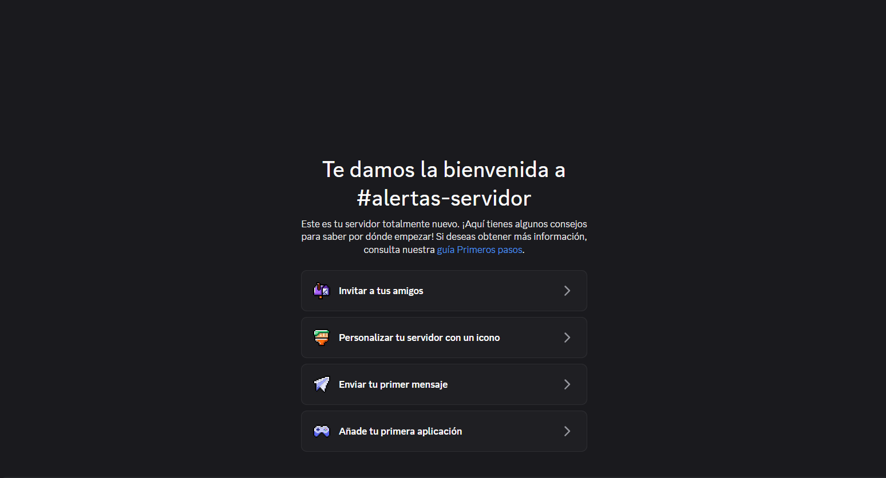
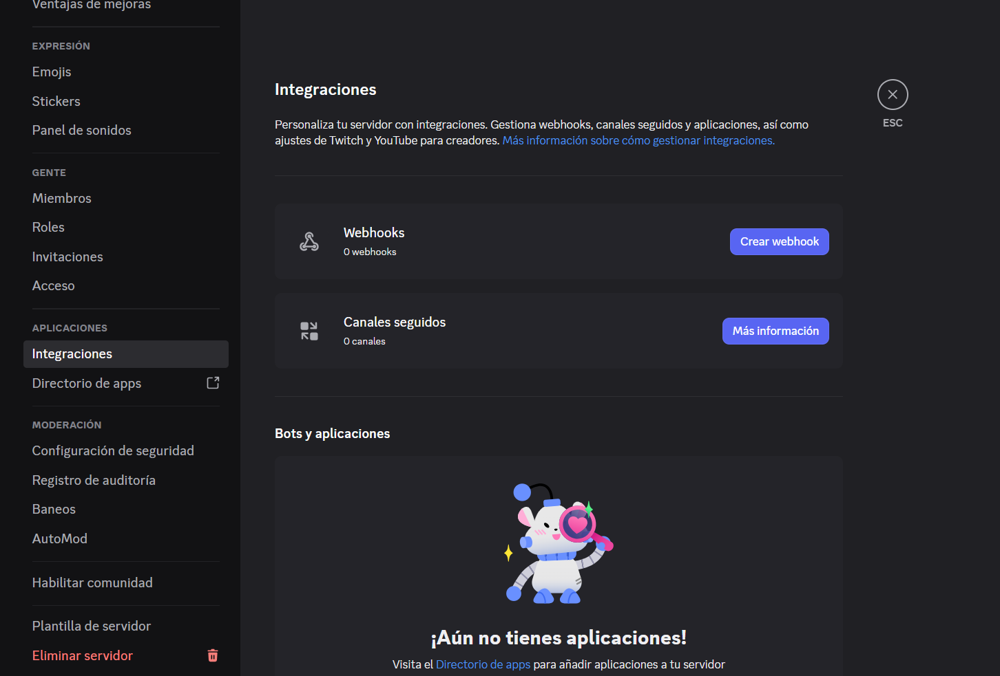
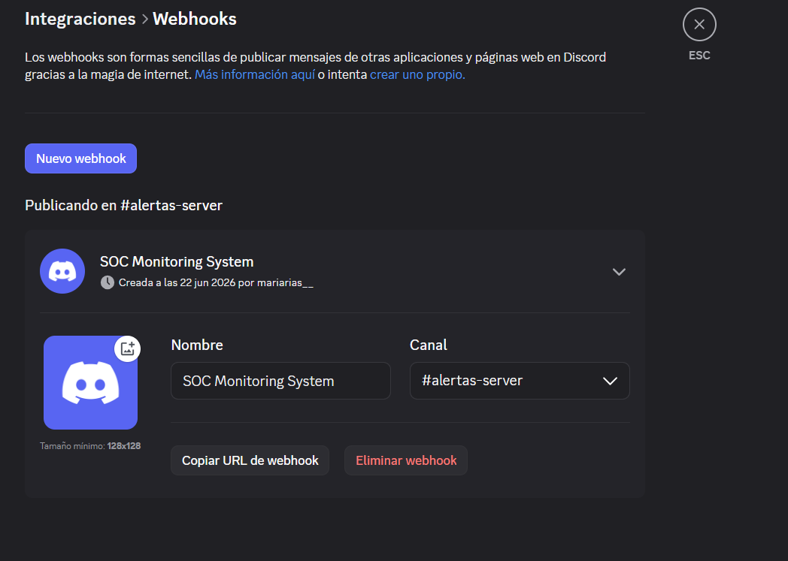
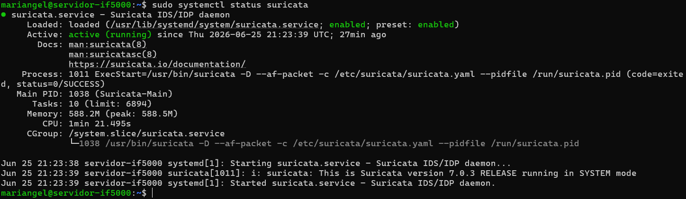
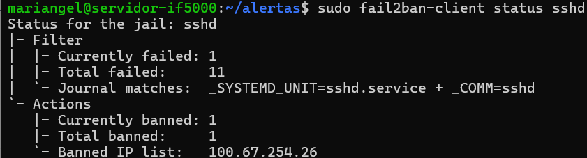
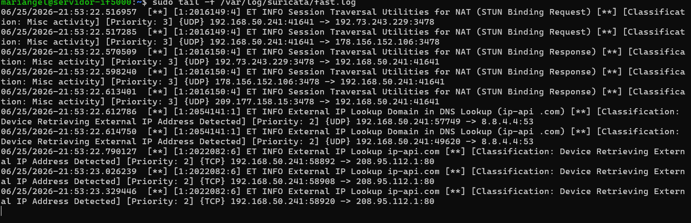

# 16 — Sistema SOC con Alertas a Discord

| Campo        | Valor                                         |
|--------------|-----------------------------------------------|
| Canal destino | Discord (webhook)                            |
| Directorio en servidor | `/home/mariangel/soc-alerting/`    |
| Servicios systemd | 3 daemons permanentes                   |
| Herramientas base | Suricata + Fail2ban + auth.log          |

---

## 1. ¿Qué es este sistema?

El sistema SOC (Security Operations Center) implementado consiste en un conjunto de scripts Bash que monitorean los logs del servidor en tiempo real y envían alertas automáticas a un canal de Discord mediante webhooks. No requiere ningún contenedor adicional — corre directamente en el sistema operativo como servicios systemd.

**Arquitectura general:**

```
/var/log/suricata/eve.json  ──→  suricata-watcher.sh  ─┐
/var/log/suricata/eve.json  ──→  fail2ban-watcher.sh   ─┤
/var/log/suricata/eve.json  ──→  soc-v2.sh             ─┤──→ Discord Webhook
/var/log/fail2ban.log       ──→  fail2ban-realtime.sh  ─┤
/var/log/auth.log           ──→  soc-engine.sh         ─┘
```

---

## 2. Scripts del sistema

### 2.1 `suricata-watcher.sh` — Alertas IDS Agregadas

Monitorea `eve.json` de Suricata y **agrega** las alertas por IP + firma en ventanas de 60 segundos. En vez de enviar un mensaje por cada paquete, espera y envía un resumen: "esta IP generó N alertas del tipo X en los últimos 60s".

Características:
- Filtra IPs privadas (192.168.x, 10.x) — solo alerta sobre tráfico externo
- Consulta geolocalización de la IP atacante via `ip-api.com`
- Evita spam de mensajes repetitivos

Ejemplo de alerta enviada a Discord:
```
🚨 SURICATA ALERT (AGREGADA)
Signature: ET SCAN Nmap Scripting Engine User-Agent Detected
Source IP: 203.0.113.45
Events: 12 en 60s
Location: Moscow, Moscow, Russia
Server: servidor-if5000
```

---

### 2.2 `soc-engine.sh` — Monitor SSH

Monitorea `/var/log/auth.log` y envía alertas para:

- **Login exitoso:** usuario, IP, puerto, método de autenticación (password / ssh-key), geolocalización, y si la IP es nueva o conocida.
- **Sesión cerrada:** usuario y timestamp (con deduplicación anti-spam).

Ejemplo de alerta de login:
```
🔐 LOGIN EXITOSO
User: mariangel
IP: 100.67.254.26
Port: 52341
Auth: ssh-key
🆕 NUEVA IP DETECTADA
Geo: San José, Costa Rica | ISP: Tigo Costa Rica
Server: servidor-if5000
```

---

### 2.3 `fail2ban-realtime.sh` — Bans en Tiempo Real

Monitorea `/var/log/fail2ban.log` y envía una alerta a Discord cada vez que Fail2ban banea una IP por fuerza bruta en SSH.

Ejemplo de alerta:
```
🚨 ALERTA REAL SOC
IP bloqueada: 203.0.113.45
Evento: Fail2ban BAN
Servidor: servidor-if5000
Hora: Thu Jun 25 14:32:01 UTC 2026
```

---

### 2.4 `fail2ban-watcher.sh` — Detección SCAN en Tiempo Real

Monitorea `eve.json` y envía alerta inmediata (sin agregación) cuando detecta firmas de tipo SCAN o Nmap. Es complementario a `suricata-watcher.sh` — este es más rápido pero más verboso.

Ejemplo de alerta:
```
🚨 SOC ALERT - PORT SCAN DETECTED | IP: 203.0.113.45 | Sig: ET SCAN Nmap Scripting Engine
```

---

### 2.5 `soc-v2.sh` — Motor de Correlación de Amenazas

El script más avanzado. Combina Suricata + Fail2ban para asignar un **score de riesgo** a cada IP. Si el score supera 60 puntos, envía una alerta correlacionada:

| Evento detectado | Puntos |
|---|---|
| Port scan (SCAN/Nmap en eve.json) | +50 |
| IP en fail2ban.log (brute force SSH) | +30 |
| HTTP probing (firma HTTP en eve.json) | +20 |

Ejemplo de alerta correlacionada:
```
🚨 SOC v2 - THREAT CORRELATED
IP: 203.0.113.45
Risk Score: 80/100

Events:
- Port Scan detected
- SSH brute force detected

Server: servidor-if5000
```

---

### 2.6 Scripts de utilidad

| Script | Uso |
|---|---|
| `test-discord.sh` | Prueba que el webhook de Discord funciona |
| `fail2ban-alerta.sh` | Envía una alerta simulada (demo) |
| `soc-dashboard.sh` | Muestra resumen CLI: IPs baneadas, uptime, bans recientes |

---

## 3. Servicios systemd

Los tres daemons principales corren permanentemente como servicios del sistema:

| Servicio | Script que ejecuta | Descripción |
|---|---|---|
| `suricata-watcher.service` | `suricata-watcher.sh` | Alertas IDS agregadas |
| `fail2ban-watcher.service` | `fail2ban-watcher.sh` | Detección SCAN en tiempo real |
| `ssh-monitor.service` | `soc-engine.sh` | Monitor de logins SSH |

---

## 4. Despliegue en el servidor

### 4.1 Crear estructura de directorios

```bash
mkdir -p /home/mariangel/soc-alerting/scripts
```

### 4.2 Copiar los scripts del repositorio

Desde el directorio raíz del repositorio clonado:

```bash
cp scripts/*.sh /home/mariangel/soc-alerting/scripts/
chmod +x /home/mariangel/soc-alerting/scripts/*.sh
```

### 4.3 Configurar el webhook de Discord

Editar cada script y reemplazar `WEBHOOK_HERE` con la URL real del webhook:

```bash
WEBHOOK="https://discord.com/api/webhooks/XXXX/YYYY"
```

Hacerlo para todos los scripts que lo usan:

```bash
cd /home/mariangel/soc-alerting/scripts/
sudo nano suricata-watcher.sh
sudo nano soc-engine.sh
sudo nano fail2ban-realtime.sh
sudo nano fail2ban-watcher.sh
sudo nano soc-v2.sh
```

> **Nota de seguridad:** La URL del webhook no se incluye en el repositorio Git. Solo existe en el servidor.

### 4.4 Verificar el webhook con el script de prueba

```bash
bash /home/mariangel/soc-alerting/scripts/test-discord.sh
```

Debe aparecer un mensaje en el canal de Discord.

### 4.5 Instalar los servicios systemd

```bash
# Copiar los archivos de servicio
sudo cp systemd/suricata-watcher.service /etc/systemd/system/
sudo cp systemd/fail2ban-watcher.service /etc/systemd/system/
sudo cp systemd/ssh-monitor.service /etc/systemd/system/

# Recargar systemd
sudo systemctl daemon-reload

# Habilitar e iniciar los tres servicios
sudo systemctl enable --now suricata-watcher
sudo systemctl enable --now fail2ban-watcher
sudo systemctl enable --now ssh-monitor
```

> **Nota:** El archivo `ssh-monitor.service` apunta al script `soc-engine.sh` 
> (renombrado como `soc-ssh-monitor.sh` en el servicio). Al copiar, renombrar:
> ```bash
> cp /home/mariangel/soc-alerting/scripts/soc-engine.sh \
>    /home/mariangel/soc-alerting/scripts/soc-ssh-monitor.sh
> ```

### 4.6 Verificar que los servicios están activos

```bash
sudo systemctl status suricata-watcher
sudo systemctl status fail2ban-watcher
sudo systemctl status ssh-monitor
```

Los tres deben mostrar `active (running)`.

---

## 5. Cómo crear el webhook en Discord

1. Abrir el servidor de Discord
2. Ir al canal donde se recibirán las alertas → **Editar canal** (⚙️)
3. **Integraciones** → **Webhooks** → **Nuevo Webhook**
4. Asignarle un nombre (ej. `servidor-if5000 SOC`)
5. Copiar la URL del webhook
6. Pegar la URL en los scripts (paso 4.3)

---

## 6. Verificar alertas en funcionamiento

Para disparar una alerta de prueba de Fail2ban:

```bash
bash /home/mariangel/soc-alerting/scripts/fail2ban-alerta.sh
```

Para ver el log del daemon en tiempo real:

```bash
sudo journalctl -u suricata-watcher -f
sudo journalctl -u fail2ban-watcher -f
sudo journalctl -u ssh-monitor -f
```

---

## 7. Ver el dashboard CLI

```bash
bash /home/mariangel/soc-alerting/scripts/soc-dashboard.sh
```

---

## Capturas de pantalla

**Prerrequisitos:**





**Estructura en el servidor:**





**Configuración de Discord:**







**Sistema funcionando:**







---

## Fuentes

- Discord Webhooks API: https://discord.com/developers/docs/resources/webhook
- Suricata EVE JSON: https://docs.suricata.io/en/latest/output/eve/eve-json-output.html
- Fail2ban Wiki: https://github.com/fail2ban/fail2ban/wiki
- ip-api.com (geolocalización): https://ip-api.com/docs
